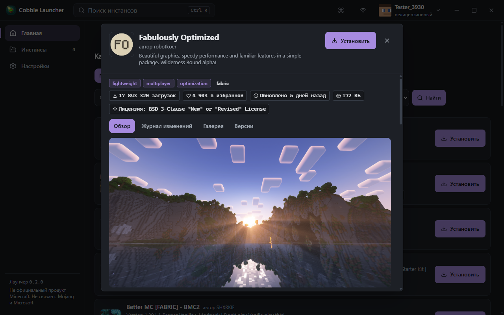

<div align="center">

# Cobble Launcher

**Быстрый и честный лаунчер Minecraft для Windows**

[Скачать 0.2.0](https://github.com/loxord241/Cobble-Launcher/releases/latest) · [Демо-видео](docs/anim-demo.mp4) · [Документация](docs/README.md)

Tauri 2 · Rust · React 19 · TypeScript

</div>

---

Cobble — настольный лаунчер с нативным ядром на Rust и лёгким интерфейсом на React. Никаких браузерных движков в фоне, никаких «ускорителей» и инжекций в игру: только официальные источники, проверка каждого файла по хэшу и sodium-стек для оптимизации.

<div align="center">
  
</div>

## Возможности

**Каталог контента**

- Каталог Modrinth на главной: модпаки и моды, поиск, сортировки (загрузки / избранное / обновления), фильтр загрузчика, бесконечный скролл
- Окно проекта как в CurseForge: Обзор / Журнал изменений / Галерея / Версии — с описанием, скриншотами и историей версий
- Установка модпаков в новый инстанс и модов — прямо из окна проекта
- Добавление модов прямо со страницы инстанса, пакетная проверка и обновление

**Инстансы**

- Изолированные инстансы: своя версия, загрузчик (Fabric / Quilt / Forge / NeoForge), моды и настройки
- Полоса прогресса скачивания и живой статус прямо в карточке инстанса
- Полный контроль: RAM, версия Java, JVM-флаги, аргументы игры, Quick Play, переименование, дублирование, бэкапы и снапшоты модов
- Защита данных: запущенный инстанс нельзя удалить или повредить; двойной запуск исключён на уровне ядра

**Профили и аккаунты**

- Microsoft (честный браузерный OAuth), Ely.by (authlib-injector) и офлайн-профили
- Офлайн-профили всегда честно помечены как нелицензионные
- Refresh-токены хранятся только в системном keyring
- Discord Rich Presence: статус игры в профиле Discord

**Диагностика и оформление**

- Живой просмотрщик логов с фильтрами + чтение gz-ротатов, отправка на mclo.gs
- Автоматический анализ крашей с конкретными рекомендациями
- Палитры тем (включая варианты для дальтоников), смена логотипа лаунчера, аккуратные анимации с поддержкой «уменьшить движение»
- Интерфейс на английском (по умолчанию), русском и украинском

<div align="center">
  <table>
    <tr>
      <td></td>
      <td></td>
    </tr>
  </table>
</div>

## Безопасность и приватность

- **Только официальные источники**: Mojang, Modrinth, Adoptium — каждый файл сверяется по хэшу с сервера. Зеркала без проверки хэшей запрещены по принципам проекта.
- **Ноль инжекций в игру**: лаунчер не модифицирует процесс Minecraft. Единственное исключение — authlib-injector для Ely.by, работающий в рамках этой службы.
- **Секреты не покидают систему**: токены — в keyring Windows, в логах включено автоматическое скрытие секретов.

## Скачать

Готовые установщики (NSIS и MSI, Windows x64) — на странице
[релизов](https://github.com/loxord241/Cobble-Launcher/releases/latest).
Кнопка «Проверить обновления» в настройках сверяется с тем же источником.

## Сборка из исходников

Требуется Node.js 20+, Rust (stable) и пакетный менеджер npm.

```bash
npm install        # зависимости фронтенда
npm run tauri dev  # запуск в режиме разработки
```

Релизная сборка (установщики NSIS и MSI в `src-tauri/target/release/bundle/`):

```bash
npm run tauri build
```

Проверки качества:

```bash
npm run build                # TypeScript strict + Vite
cd src-tauri && cargo test   # 300+ тестов ядра и движка загрузок
```

## Стек и структура

| Слой | Технологии |
|---|---|
| Интерфейс | React 19, TypeScript strict, Tailwind 4 |
| Ядро | Rust, Tauri 2, tokio |
| Контент | Modrinth API, манифесты Mojang, Adoptium |

- `src/` — интерфейс: страницы, компоненты, темы, i18n (en, ru, uk)
- `src-tauri/src/` — ядро: инстансы и запуск, загрузки по хэшам, Modrinth, авторизация
- `docs/` — [карта документации](docs/README.md): [контракт ядро↔UI](docs/UI-CONTRACT.md), [реестр решений](docs/DECISIONS.md), [статус этапов](docs/PROGRESS.md)
- `scripts/` — приёмочные тесты: сквозные проверки UI, жизненного цикла процесса, интеграции Modrinth

## Лицензия и бренды

Код проекта — под лицензией **MIT** (см. [LICENSE](LICENSE)); прямые зависимости
и их лицензии — в [THIRD-PARTY-LICENSES.md](THIRD-PARTY-LICENSES.md),
атрибуция и товарные знаки — в [NOTICE](NOTICE).

**Не официальный продукт Minecraft. Не связан с Mojang и Microsoft.**

Not an official Minecraft product. Not approved by or associated with Mojang or Microsoft.

**Не офіційний продукт Minecraft. Не пов'язаний з Mojang та Microsoft.**

Minecraft — товарный знак Mojang Synergies AB. Названия Mojang, Microsoft, Xbox
и Minecraft используются только для описания совместимости; лаунчер не
распространяет файлы игры, а скачивает их с официальных серверов Mojang по
сверенным хэшам.
