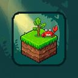
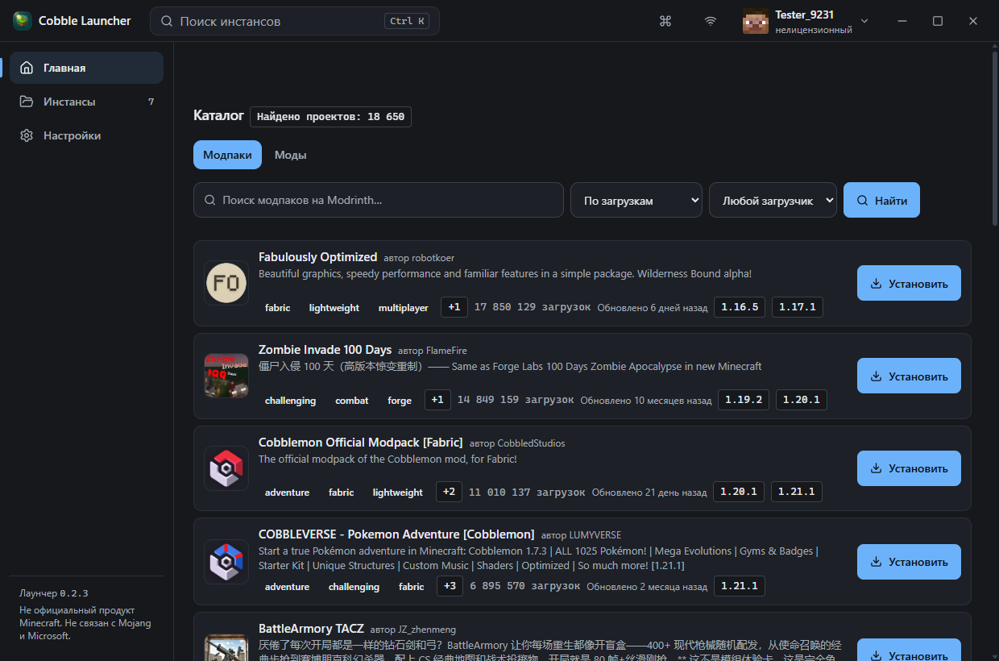
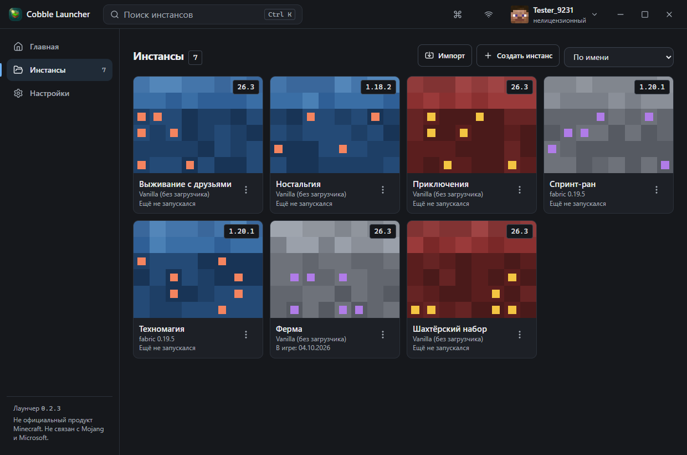
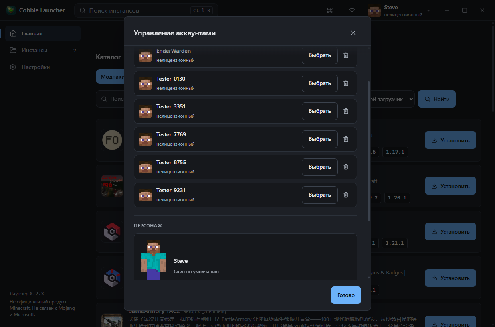
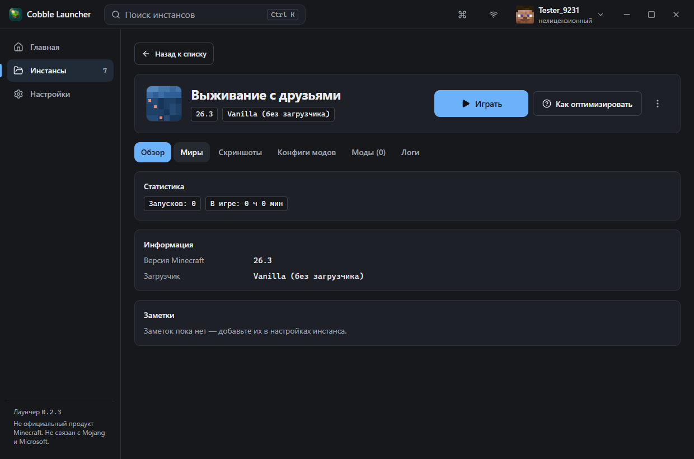
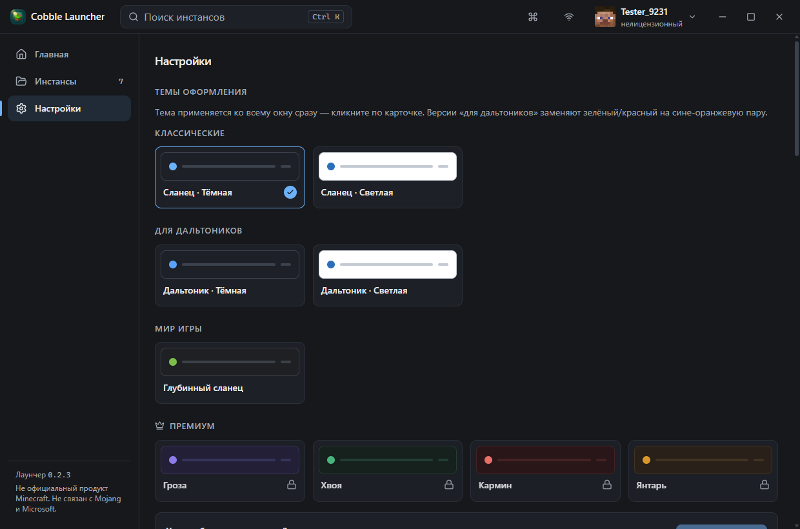

<div align="center">

<sub>[English](README.md) · <b>Русский</b> · [Українська](README.uk.md) · [Polski](README.pl.md)</sub>



# Cobble Launcher

**Честный лаунчер Minecraft для Windows**

[](https://github.com/loxord241/Cobble-Launcher/releases/latest)
[](LICENSE)
[](https://github.com/loxord241/Cobble-Launcher/releases/latest)
[](#языки)
[](#сборка-из-исходников)

**[Скачать последнюю версию](https://github.com/loxord241/Cobble-Launcher/releases/latest)** ·
[Сообщить о проблеме](https://github.com/loxord241/Cobble-Launcher/issues) ·
[Демо-видео](docs/anim-demo.mp4)
· [Сайт Cobble Launcher](https://loxord241.github.io/Cobble-Launcher/)



Tauri 2 · Rust · React 19 · TypeScript

</div>

---

Cobble — настольный лаунчер с нативным ядром на Rust и лёгким интерфейсом на
React. Никаких браузерных движков в фоне, никаких «ускорителей» и инжекций в
игру: только официальные источники, проверка каждого файла по хэшу и
sodium-стек для оптимизации.

## Каталог Modrinth

- Каталог на главной: модпаки и моды, поиск, сортировки (загрузки / избранное /
  обновления), фильтр загрузчика, бесконечный скролл
- Окно проекта как в CurseForge: Обзор / Журнал изменений / Галерея / Версии
- Установка модпаков в новый инстанс и модов — прямо из окна проекта или со
  страницы инстанса; пакетное обновление модов в один клик

## Инстансы

- Изолированные инстансы: своя версия, загрузчик (Fabric / Quilt / Forge /
  NeoForge), моды и настройки
- Прогресс скачивания и живой статус прямо в карточке; защита от двойного
  запуска и от порчи работающего инстанса — на уровне ядра
- Полный контроль: RAM, версия Java (автоустановка Adoptium), пресеты JVM-флагов,
  Quick Play, профили на инстанс, переименование, дублирование, бэкапы и
  снапшоты модов с откатом
- Миры, скриншоты и конфиги модов — прямо со страницы инстанса

## Профили

- Microsoft (браузерный OAuth), Ely.by (authlib-injector) и офлайн-профили;
  офлайн — честно помечены как нелицензионные
- Аватарки: голова скина для Microsoft / Ely.by, классический Стив — для
  офлайна
- Refresh-токены — только в системном keyring Windows
- Discord Rich Presence: название инстанса в статусе Discord

<div align="center">
  <table>
    <tr>
      <td></td>
      <td></td>
    </tr>
    <tr>
      <td></td>
      <td></td>
    </tr>
  </table>
</div>

## Автообновления

Лаунчер сам проверяет релизы (раз за сессию, тихо) и показывает бейдж
«Доступно обновление». Установка — одной кнопкой: подписанный апдейт
(minisign), прогресс скачивания, автоматический перезапуск. Ваши инстансы,
профили и настройки остаются на месте.

## Безопасность и приватность

- **Только официальные источники**: Mojang, Modrinth, Adoptium — каждый файл
  сверяется по хэшу с сервера. Зеркала без проверки хэшей запрещены принципами
  проекта.
- **Ноль инжекций в игру**: лаунчер не модифицирует процесс Minecraft.
  Единственное исключение — authlib-injector для Ely.by, работающий в рамках
  этой службы.
- **Секреты не покидают систему**: токены — в keyring Windows, в логах
  включено автоматическое скрытие секретов.

## Языки

Русский · English · Українська · Polski — переключаются в онбординге и
настройках, применяются ко всему интерфейсу, ошибкам и форматам дат.

## Скачать

Готовые установщики (NSIS и MSI, Windows 10/11 x64) — на странице
[релизов](https://github.com/loxord241/Cobble-Launcher/releases/latest).
После установки обновления приходят сами; вручную — кнопка «Проверить
обновления» в настройках.

## Сборка из исходников

Требуется Node.js 20+, Rust (stable) и npm.

```bash
npm install        # зависимости фронтенда
npm run tauri dev  # запуск в режиме разработки
```

Релизная сборка (установщики NSIS и MSI в `src-tauri/target/release/bundle/`):

```bash
npm run tauri build
```

Проверки качества:

```bash
npm run build                # TypeScript strict + Vite
cd src-tauri && cargo test   # 457 теста ядра + 10 интеграционных
```

## Стек и структура

| Слой | Технологии |
|---|---|
| Интерфейс | React 19, TypeScript strict, Tailwind 4 |
| Ядро | Rust, Tauri 2, tokio |
| Контент | Modrinth API, манифесты Mojang, Adoptium |

- `src/` — интерфейс: страницы, компоненты, темы, i18n (ru, en, uk, pl)
- `src-tauri/src/` — ядро: инстансы и запуск, загрузки по хэшам, Modrinth,
  авторизация, автообновление
- `docs/` — [карта документации](docs/README.md):
  [контракт ядро↔UI](docs/UI-CONTRACT.md),
  [реестр решений](docs/DECISIONS.md), [статус этапов](docs/PROGRESS.md)
- `scripts/` — приёмочные тесты: сквозные проверки UI, жизненного цикла
  процесса, интеграции Modrinth

## Лицензия и бренды

Код проекта — под лицензией **MIT** (см. [LICENSE](LICENSE)); прямые
зависимости и их лицензии — в [THIRD-PARTY-LICENSES.md](THIRD-PARTY-LICENSES.md),
атрибуция и товарные знаки — в [NOTICE](NOTICE).

**Не официальный продукт Minecraft. Не связан с Mojang и Microsoft.**

**Not an official Minecraft product. Not approved by or associated with Mojang or Microsoft.**

**Не офіційний продукт Minecraft. Не пов'язаний з Mojang та Microsoft.**

**Nieoficjalny produkt Minecraft. Niepowiązany z Mojang i Microsoft.**

Minecraft — товарный знак Mojang Synergies AB. Названия Mojang, Microsoft, Xbox
и Minecraft используются только для описания совместимости; лаунчер не
распространяет файлы игры, а скачивает их с официальных серверов Mojang по
сверенным хэшам.
